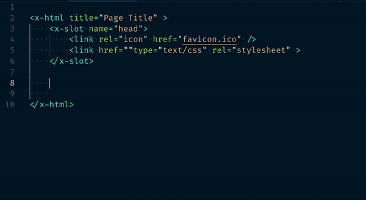
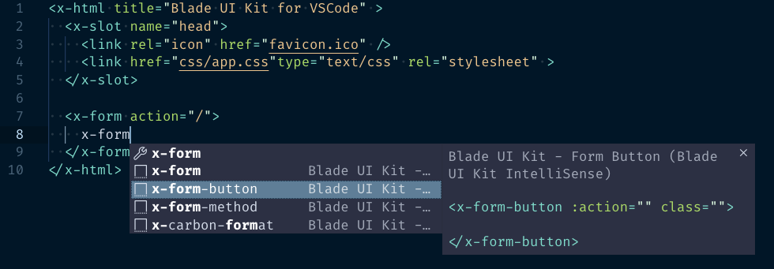

# Blade UI Kit - VSCode

Simple IntelliSense & Snippets for [Blade UI Kit](https://blade-ui-kit.com).

## Snippets





## Settings and Contributions

This extension contributes:
- The `package.json` file includes a `blade` language configuration as defined by [Laravel Blade Snippets](https://marketplace.visualstudio.com/items?itemName=onecentlin.laravel-blade) _(syntax, grammar etc.)_ amongst others.

```
    "id": "blade",
    "extensions": [
        ".blade.php"
    ]
```
- The `package.json` file also includes a `html` language configuration snippet, for configurations where `blade` is associated with `html` in user-settings:
```
    "files.associations": {
        "*.blade.php": "html"
    },

```

| Prefix | Body |
| ------ | ---- |
|x-alert|`` <x-alert$0 /> ``|
|x-alert-slot|`` <x-alert class="$1" > $0</x-alert> ``|
|x-form-button|`` <x-form-button :action="$1" class="$2"> $0</x-form-button> ``|
|x-logout|`` <x-logout$0 /> ``|
|x-logout-action|`` <x-logout :action="$1"$0 /> ``|
|x-carbon|`` <x-carbon :date="$1"${2\| , human, local\|} $0 /> ``|
|x-carbon-format|`` <x-carbon :date="$1" format="$2d/m/Y H:i"${3\| , human, local\|}$0 /> ``|
|x-countdown|`` <x-countdown :expires="$0"/> ``|
|x-countdown-slot|`` <x-countdown :expires="$1">$0</x-countdown> ``|
|x-easy-mde|`` <x-easy-mde name="$1"$0 /> ``|
|x-easy-options|`` <x-easy-mde name="$1" :options="[$1]"$0 /> ``|
|x-trix|`` <x-trix name="$1"$0 /> ``|
|x-trix-styles|`` <x-trix name="$1" styles="$2"$0 /> ``|
|x-error|`` <x-error field="$1"$0 /> ``|
|x-error-ul|`` <x-error field="$1"$0> <ul>  @foreach ($${2:component}->messages($${3:error}s) as $${3:error})   <li>{{ $${3:error} }}</li>  @endforeach </ul></x-error> ``|
|x-form|`` <x-form action="$1"> $0</x-form> ``|
|x-form-method|`` <x-form method="$1" action="$2"> $0</x-form> ``|
|x-label|`` <x-label for="$1"$0 /> ``|
|x-label-slot|`` <x-label for="$1">$0</label> ``|
|x-checkbox|`` <x-checkbox name="$1"$0 /> ``|
|x-color-picker|`` <x-color-picker name="$1"$0 /> ``|
|x-color-pick-opt|`` <x-color-picker name="$1" :options="$2"$0 /> ``|
|x-email|`` <x-email name="$1"$0 /> ``|
|x-input|`` <x-input name="$1"$0 /> ``|
|x-password|`` <x-password name="$1"$0 /> ``|
|x-pickaday|`` <x-pickaday name="$1"$0 /> ``|
|x-pickaday-opt|`` <x-pickaday name="$1" :options="$2"$0 /> ``|
|x-textarea|`` <x-textarea name="$1"$0 /> ``|
|x-textarea-rows|`` <x-textarea name="$1" rows="$2"$3 > $0</textarea> ``|
|x-html|`` <x-html title="$1"$2 > $0</x-html> ``|
|x-html-head|`` <x-slot name="head"> <link rel="icon" href="favicon.ico" /> <link href="type="text/css" rel="stylesheet" ></x-slot>$0 ``|
|x-social|`` <x-social-meta title="$1" description="$2" image="$3"/>$0 ``|
|x-mapbox|`` <x-mapbox :markers="$1" :options="$2"$0 /> ``|
|x-markdown|`` <x-markdown name="$1"${2\| , flavor="github"\|} :options="$3"> $0</x-markdown> ``|
|x-toc|`` <x-toc> $0</x-toc> ``|
|x-dropdown|`` <x-dropdown class="$1"> <x-slot name="${2:trigger}">  <button>   $3  </button> </x-slot> <a href="#">$0</a> <a href="#"></a></x-dropdown> ``|
|x-dropdown-escape|`` <x-dropdown @keydown.escape.window="open = false" class="$1"> <x-slot name="${2:trigger}">  <button>   $3  </button> </x-slot> <a href="#">$0</a> <a href="#"></a></x-dropdown> ``|
|x-avatar|`` <x-avatar search="$1"${2\| , provider="\|}$0 /> ``|
|x-cron|`` <x-cron schedule="$1"${2\| , human\|}$0 /> ``|
|x-unsplash|`` <x-unsplash proto="$1" ttl="$2"$0 /> ``|
|x-unsplash-query|`` <x-unsplash query="$1" username="$2" ttl="$3"${4\| , featured\|}$0 /> ``|


## Changelog

Check out the [CHANGELOG](CHANGELOG.md) in this repository for all the recent changes.

## License

Blade UI Kit is open-sourced software licensed under [the MIT license](LICENSE.md).
